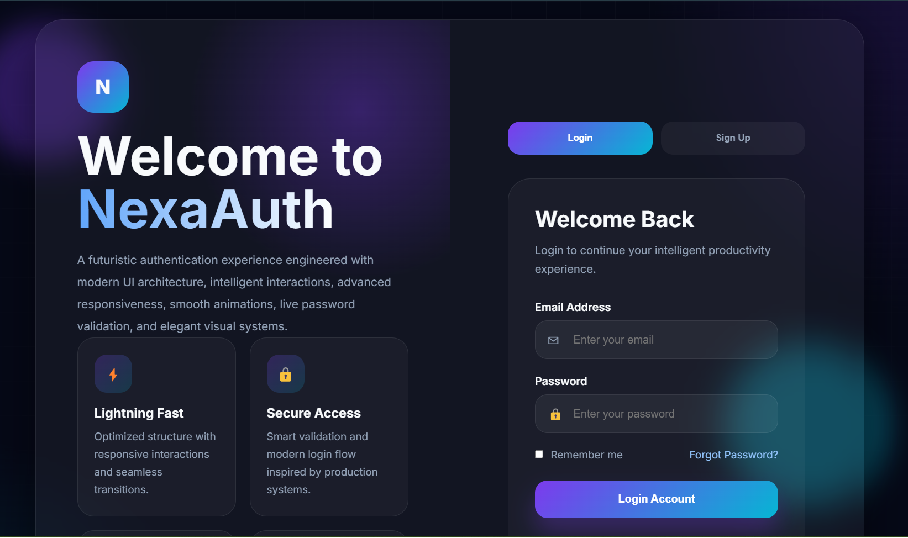

# NexaAuth Authentication Platform

NexaAuth is a modern authentication interface built to deliver a secure, seamless and visually refined user access experience.

The project focuses on creating a professional frontend authentication flow with structured UI architecture, responsive interaction patterns and clean accessibility-focused design principles suitable for modern web applications and SaaS platforms.

---

## Features

✔ Modern authentication interface  
✔ Sign in and sign up workflows  
✔ Responsive layout across devices  
✔ Interactive UI transitions and hover states  
✔ Clean visual hierarchy  
✔ User-focused form experience  
✔ Professional SaaS-inspired design system  
✔ Optimized frontend structure  

---

## Preview

middlepage.png

---

## Live Demo

View hosted project:

https:https://josephstephen-dev.github.io/auth-ui/

---

## Repository

Source code:

https://github.com/josephstephen-dev/nexaauth-authentication-ui

---

## Technologies Used

- HTML5  
- CSS3  
- JavaScript  
- Responsive Design Principles  
- Modern UI/UX Design Concepts  

---

## Purpose

This project was developed to explore modern authentication interface design and frontend interaction systems used in contemporary digital platforms.

NexaAuth emphasizes structured component layout, accessibility-conscious form design, responsive responsiveness and polished user interaction experiences while maintaining a clean and scalable frontend architecture.

---

## Future Improvements

Possible future additions:

- Backend authentication integration  
- OAuth and social login support  
- Password recovery workflow  
- Multi-factor authentication (MFA)  
- User session management  
- Dark/light theme switching  
- API integration  
- Form validation enhancements  

---

## Author

Joseph Stephen  
Frontend Developer focused on modern interfaces, scalable frontend systems and interactive digital experiences.

GitHub:

https://github.com/josephstephen-dev
